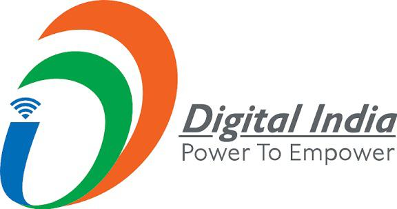
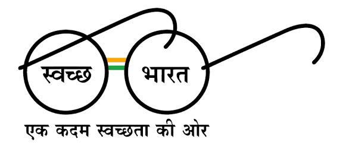
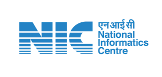

# AMO ESIS Portal

## Employees' State Insurance Scheme, Government of Meghalaya


> **Modernizing Public Services: A Responsive, Accessible, and Compliant Government Portal**

---

## 📌 Overview

The **AMO ESIS Portal** is a comprehensive digital solution designed to streamline Employees' State Insurance Scheme services and medical care information for the citizens and insured persons of Meghalaya. This portal represents a significant step towards digital transformation in government service delivery, combining modern web standards with rigorous compliance frameworks.

Built with accessibility and inclusion at its core, the portal ensures equitable access to social security benefits and medical services for all citizens, irrespective of their technical proficiency or physical abilities.

---

## ✨ Key Features

### 🎯 Citizen-Centric Design

- **Intuitive Navigation**: Simplified hierarchy for easy access to insurance benefits, applications, and healthcare services
- **Clear Information Architecture**: Organized content aligned with citizen needs, insured persons' requirements, and department objectives
- **Mobile-First Approach**: Seamless experience across devices—desktop, tablet, and mobile

### 🔒 Accessibility & Inclusivity

- **WCAG 2.1 AA Compliant**: Full compliance with Web Content Accessibility Guidelines
- **Screen Reader Support**: Optimized for assistive technologies and features a dedicated Screen Reader Access guide
- **Keyboard Navigation**: Complete functionality without mouse dependency, including arrow key support in sidebars
- **Advanced Layout Controls**: Multiple theme overrides (Dark, White, Normal contrast) and dynamic typography tools (Increase/Decrease text sizes up to 130%/85%, Text Spacing toggles, Line Height adjustments) with full state persistence in localStorage

### 🏛️ Government Compliance

- **GIGW 3.0 Certified**: Adheres to Guidelines for Indian Government Websites
- **GIGW 3.0 Branding**: Official government color scheme and branding guidelines (maroon, white, and cream palette)
- **Data Privacy**: Compliant with Digital Personal Data Protection Act, 2023
- **Security Standards**: Meets Government of India cybersecurity requirements
- **Responsive Design**: Works across all platforms and browsers

### ⚡ Performance & Reliability

- **Fast Load Times**: Optimized for users on 2G/3G connections
- **Lightweight Architecture**: Minimal dependencies; client-side rendering with deferred scripting
- **Zero-Database Dependency**: Static content delivery for improved reliability
- **Cross-Browser Support**: Chrome, Firefox, Safari, Edge compatibility
- **Offline Capability**: Core functionality available without internet

### 📱 Progressive Enhancement

- **Semantic HTML5**: Proper markup using landmarks for better SEO and accessibility
- **Modern CSS3**: Flexbox and CSS Grid for responsive layouts with CSS Custom Properties
- **Vanilla JavaScript**: No external frameworks or jQuery; pure, clean, and maintainable code

---

## 🔗 Important Government Links

The AMO ESIS Portal integrates seamlessly with national and state-level initiatives. Below are the key government portals linked from our platform:

<table align="center">

<!-- ROW 1 -->
<tr>
<td align="center" width="200" style="padding:10px;">
National Portal of India <br><br>
<a href="https://india.gov.in" target="_blank">

</a>
</td>

<td align="center" width="200" style="padding:10px;">
Meghalaya State Portal <br><br>
<a href="https://meghalaya.gov.in/" target="_blank">

</a>
</td>
<td align="center" width="200" style="padding:10px;">
Digital India <br><br>
<a href="https://www.digitalindia.gov.in" target="_blank">

</a>
</td>

<td align="center" width="200" style="padding:10px;">
Make in India <br><br>
<a href="https://www.makeinindia.com" target="_blank">

</a>
</td>

</tr>

<!-- ROW 2 -->
<tr>

<td align="center" width="200" style="padding:10px;">
MyGov <br><br>
<a href="https://www.mygov.in" target="_blank">

</a>
</td>

<td align="center" width="200" style="padding:10px;">
PM India <br><br>
<a href="https://www.pmindia.gov.in" target="_blank">

</a>
</td>

<td align="center" width="200" style="padding:10px;">
Swachh Bharat Mission <br><br>
<a href="https://swachhbharatmission.gov.in" target="_blank">

</a>
</td>

<td align="center" width="200" style="padding:10px;">
National Informatics Centre <br><br>
<a href="https://www.nic.in/" target="_blank">

</a>
</td>
</tr>

</table>

---

## 🛠️ Technology Stack

| Component           | Technology                              |
| ------------------- | --------------------------------------- |
| **Markup**          | HTML5 (Semantic and ARIA compliant)     |
| **Styling**         | CSS3 (Flexbox, Grid, Custom Properties) |
| **Interactivity**   | Vanilla JavaScript (ES6+)               |
| **Architecture**    | Client-side static architecture         |
| **Hosting**         | NIC Cloud / State Data Centre           |

**No External Dependencies**: The portal uses pure HTML, CSS, and JavaScript—ensuring minimal attack surface, faster load times, and maximum compatibility.

---

## 📂 Project Structure

```
AMO ESIS/
├── index.html                 # Main portal redirect & splash entry point
├── home.html                  # Homepage with vision, mission, and live announcements
├── esis.html                  # Detailed overview of the ESI Scheme
├── administrative-setup.html  # Administrative hierarchy & division profiles
├── organogram.html            # Interactive department organogram / flow chart
├── scheme-implementation.html  # Statistics & implementation details of the scheme
├── rules-regulations.html     # Legal frameworks, rules, and regulations
├── rti.html                   # Right to Information (RTI) disclosures & details
├── contact-us.html            # Contact directory for the Administrative Medical Officer
├── contacts.html              # Medical units directory with dynamic search & Google Maps
├── forms.html                 # Downloadable medical reimbursement & official forms
├── finances.html              # Financial allocations, audit statements, and budgets
├── faq.html                   # Frequently Asked Questions with interactive accordion
├── links.html                 # Essential external government portals & hyperlinks
├── sitemap.html               # Hierarchical sitemap of the entire portal
├── help.html                  # Help & accessibility guide (file format viewing instructions)
├── accessibility.html         # Comprehensive accessibility statement & standards compliance
├── terms.html                 # Terms & conditions, disclaimer, and hyperlinking policy
├── screen.html                # Screen Reader Access instructions & shortcuts
├── photos.html                # Main photo gallery categorizing departmental activities
├── photos_camp.html           # Photo gallery for Health Camps
├── photos_esic.html           # Photo gallery for ESIC-related programs
├── photos_telemedicine.html   # Photo gallery for Telemedicine initiatives
├── coverage-registration.html # Information on ESIC coverage and online registration
├── css/
│   ├── style.css              # Theme-aligned style system (maroon, white, cream)
│   └── responsive.css         # Media queries and responsive adjustments
├── js/
│   └── main.js                # Core JS logic: contrast themes, text sizing, and search functionality
├── images/                    # Standardized image resources (banners, gallery photos, logos)
└── documents/                 # PDF circulars, forms, and recruitment notifications
```

---

## 🚀 Getting Started

### For End Users

1. **Open in Browser**:
   - Navigate to the portal URL (will be hosted on NIC Cloud)
   - The homepage loads automatically

2. **Switch Contrast**:
   - Click the "Accessibility" options in the top header
   - Choose normal text size or high contrast/text enlargement controls

3. **Adjust Text Size**:
   - Use the font resize buttons in the accessibility menu
   - Sizing choices persist across navigation using local storage properties

4. **Use Keyboard Navigation**:
   - Press `Tab` to shift focus logically
   - Press `Enter` or `Space` to trigger links or collapsible panels
   - Use arrow keys to slide or browse lists in the sidebar menu cards

### For Developers

#### Prerequisites

- A modern code editor (VS Code, Sublime Text, etc.)
- A local development server extension (e.g., Live Server)
- Any modern web browser

#### Local Setup

```bash
# Clone the repository
git clone https://github.com/your-repo/amo-esis.git
cd "AMO ESIS"

# Start a local server (using Python)
python -m http.server 8000

# Or using Node.js
npx http-server

# Open in browser
# http://localhost:8000
```

#### Development Workflow

1. **Make Changes**: Edit HTML, CSS, or JS files
2. **Test Locally**: Refresh browser to verify responsive layout
3. **Validate**:
   - HTML: Use W3C HTML Validator
   - CSS: Verify styles inside `css/style.css` and `css/responsive.css`
   - Accessibility: Inspect with screen readers (NVDA, VoiceOver) or WAVE extension

---
## ♿ Accessibility Features

### Universal Design Principles

- **Perceivable**: Content is structured logically with ARIA properties
- **Operable**: Full keyboard accessibility across menus, tables, and buttons
- **Understandable**: Plain text instructions, clear layout, predictable interfaces
- **Robust**: Works across screen readers and text magnifying interfaces

### Implemented Standards

- WCAG 2.1 Level AA compliance
- ARIA landmarks for screen readers
- Sufficient color contrast (4.5:1 for body text)
- Focus indicators for keyboard navigation
- Alt text for all structural images
- Custom keyboard traps prevented in modal views

### Accessibility Tools

- **Built-in Advanced Typography Tools**: Increase/Decrease text sizes, Text Spacing toggle, Line Height toggle, and Reset options located in the sticky accessibility bar.
- **Contrast Switchers**: Normal theme, Dark mode contrast theme, and White contrast theme persisted site-wide.
- **Skip to Main Content** shortcut links.

---

## 🏛️ Compliance & Standards

### Government Standards

- ✅ **GIGW 3.0**: Guidelines for Indian Government Websites v3.0
- ✅ **WCAG 2.1 AA**: Web Content Accessibility Guidelines Level AA
- ✅ **DPDPA 2023**: Digital Personal Data Protection Act compliance
- ✅ **NIC Standards**: National Informatics Centre guidelines

### Security & Privacy

- SSL/TLS encryption for data in transit
- No external third-party scripts or trackers
- Privacy policy and data protection measures
- Regular security audits

### Browser Support

- Chrome/Edge 90+
- Firefox 88+
- Safari 14+
- Mobile browsers (iOS Safari, Chrome Mobile)

---

## 📋 Content Management

### Adding New Content

1. **Hospital List Updates**:
   - Edit the `HOSPITAL_DATA` array in `js/main.js`. The search filters and matching tables will automatically update.

2. **Documents & Announcements**:
   - Add new PDF files directly to the `/documents` folder.
   - Insert corresponding download elements under the announcements grid or lists within `home.html` and `forms.html` following the chronological descending order of publication.

3. **Key Contacts**:
   - Update contact details in the respective table layout structures inside `contact-us.html` and `contacts.html`.

---

## 🔄 Maintenance & Updates

### Routine Maintenance

- **Weekly**: Check notifications and news feed
- **Monthly**: Validate all links, test forms
- **Quarterly**: Security audit, performance review
- **Annually**: Full accessibility audit, content review

---

## 📄 License

This project is released under the **Open Government License – India (OGL)**. This ensures transparency, accountability, and allows for reuse by other government entities.

For details, see [LICENSE.md](LICENSE.md) and the [Open Government Data Platform](https://data.gov.in).

---

## 📊 Key Metrics

- **Accessibility Score**: 95+ (WAVE audit)
- **Page Load Time**: < 2s (on 4G), < 4s (on 3G)
- **Mobile Responsiveness**: 100% (Google PageSpeed)
- **Browser Compatibility**: 98%+

---

## 🏆 Awards & Recognition

This portal demonstrates excellence in:

- Government Digital Transformation
- Inclusive Web Design
- Citizen-Centric Service Delivery
- Open Source Government Innovation

---

## 👥 Team

**Project Under**: Office of the Administrative Medical Officer, ESIS, Government of Meghalaya
---

## ⚖️ Legal & Compliance

- **Copyright**: © Government of Meghalaya. All rights reserved.
- **Terms of Use & Privacy Policy**: See [terms.html](terms.html)
- **Accessibility Statement**: See [accessibility.html](accessibility.html)
- **Help Guide**: See [help.html](help.html)
- **Sitemap**: See [sitemap.html](sitemap.html)

---

**Last Updated**: June 2026 | 
**For the latest information, visit**: [AMO ESIS Portal](https://meghalaya.gov.in)

---

**Developed Using**: HTML5 | CSS3 | Vanilla JavaScript | ♿ WCAG 2.1 AA | 🏛️ GIGW 3.0 Compliant

**Government of Meghalaya - Office of the Administrative Medical Officer, ESIS**
